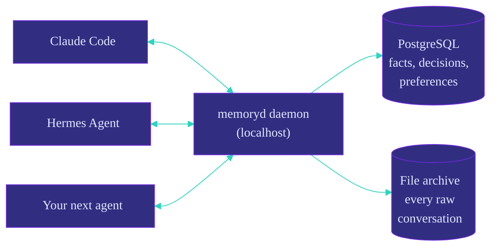
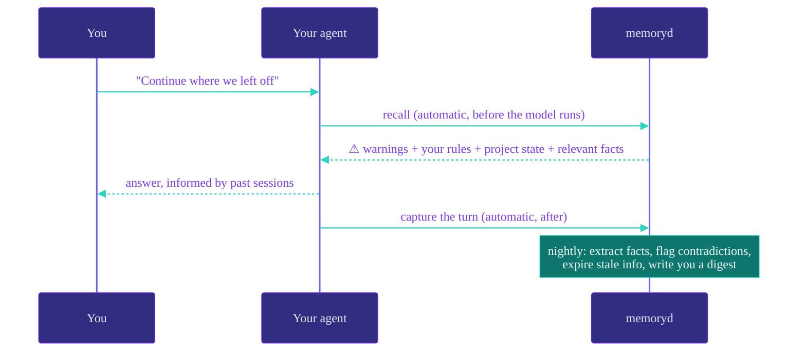

<div align="center">


<p>
  <a href="https://github.com/chrisduvillard/memoryd/actions/workflows/tests.yml"></a>
  <a href="LICENSE"></a>
  
  
  
</p>

[**Quickstart**](#-choose-your-install-path) · [**Production Hermes**](#-production-hermes-on-linux) · [**Daily use**](#-daily-use) · [**Docs**](docs/REFERENCE.md) · [**Architecture**](docs/ARCHITECTURE.md)

</div>

Claude Code forgets everything between sessions. So does Hermes, Codex, and every other agent. memoryd is a small local daemon that gives them all one shared, permanent memory — automatically, on every turn, with you in control of what gets remembered.



Your agents come and go. Your memory stays — local, on your machine, in plain Postgres and files you can read.

---

## 🧠 What it does, in plain English

**1. It remembers everything, raw.** Every conversation turn is saved to an append-only ledger and a file archive on your disk. Nothing is ever edited or deleted — this is the evidence everything else is built from.

**2. It's careful about what becomes a "fact".** After each session, an LLM proposes memories ("prefers short commit messages", "never push to main on this repo"). A strict validator then checks each one: does it cite a real source? Did it turn "I *might* switch to X" into "decided to switch to X"? (rejected). Only explicit user instructions become active automatically — everything else waits as an unconfirmed candidate or in a review queue for **you** to approve.

**3. It recalls automatically, before every turn.** You never ask it to remember. Before your agent sees your prompt, memoryd injects a small "memory packet": your standing rules and warnings first (always), then who you are and project state, then the most relevant facts — found by combining keyword and semantic search.

**4. Facts are never overwritten — they're superseded.** When you change your mind, the old fact is kept with an end date and a link to what replaced it. Your agent can answer both "what do I prefer?" and "what *did* I prefer, and when did that change?"



---

## 🛡️ Safety, built in

- **Scopes ("visas"):** each agent only sees memory it's allowed to. Personal memories never enter a coding agent's context. Verified by planted **canary memories** that must never surface — if one does, an alarm fires.
- **Contradictions open a review, never silently overwrite.** You rule; the loser gets superseded.
- **Fail-open:** if the daemon is down, your agent keeps working and tells you memory was unavailable. It never blocks you.
- **Everything is auditable:** every recalled packet is logged, every fact links back to the exact conversation that produced it.

---

## ⚡ Choose your install path

| Goal | Use this path |
|---|---|
| Evaluate memoryd or connect Claude Code on Windows, macOS, or Linux | Follow the quickstart below. |
| Make memoryd the production provider for Hermes on Linux | Exit Hermes and use the two-command guided install below. |

### Production Hermes quickstart (Linux)

Close every Hermes chat/TUI, then run these commands in a normal terminal:

```bash
pipx install --python python3.13 \
  'git+https://github.com/chrisduvillard/memoryd.git@v0.3.1'
memoryd install --hermes
```

This guided path requires Docker, Git, `pipx`, a working systemd user manager, and
Hermes Agent exactly `0.16.0`. It resolves `$HERMES_HOME` and `active_profile`,
validates the installed Hermes contract through Hermes's own Python, and stops
before mutation when the profile, version, permissions, or memory home is
unsafe. If Hermes is on another version, use the exact remediation command the
installer prints, then rerun the same guided command.

Missing OpenRouter and Voyage keys are requested with hidden terminal prompts,
validated with minimal live calls, and stored only in memoryd's owner-readable
configuration. Do not put keys on the command line or in a Hermes chat. Both
providers are required for this production path.

Fresh installs create the localhost PostgreSQL/pgvector service, apply
migrations, install the profile plugin and systemd units, and verify an initial
backup before activation. Reruns adopt only a recognized managed installation;
an unknown nonempty `~/memory` is left untouched. Activation preserves the
previous provider and gateway state. Any failure or interruption rolls Hermes
back while retaining memoryd's database, spool, archive, configuration,
backups, logs, and dead-letter evidence.

Success includes these four healthy checks:

```bash
hermes memory status
hermes memoryd config
memoryd status
hermes memoryd status
```

The detailed [production runbook](docs/PRODUCTION_ROLLOUT.md) documents the
preflight decisions, recovery drills, and emergency manual rollback. A
successful install starts a production candidate, not a promotion: complete
the [14-day, minimum-200-turn canary](docs/CANARY_SCORECARD.md) first.

### Quickstart (evaluation and local use)

Works on **Windows, macOS, and Linux**. Requires Python 3.11+ and [Docker](https://www.docker.com/products/docker-desktop/) (for the database — or bring your own Postgres, see Appendix A).

```bash
# Optional: set OPENROUTER_API_KEY in your shell to enable fact extraction.
python -m pip install git+https://github.com/chrisduvillard/memoryd.git@v0.3.1
memoryd install
memoryd status                     # Everything green? The local install is ready.
```

`memoryd install` does the rest, idempotently (safe to re-run any time):

- starts a **PostgreSQL 16 + pgvector container** (`memoryd-pgvector`, localhost-only, persistent volume, restarts with Docker) with a fresh random database password and applies all migrations
- writes `~/memory/config.json` so the daemon finds its database even when autostarted
- registers the **Claude Code hooks** in `~/.claude/settings.json` (recall before every prompt, capture after every turn)
- installs the **Hermes plugin** if `~/.hermes` exists (otherwise: re-run install after you install Hermes)
- sets up **autostart**: the daemon at logon and the nightly consolidation at 03:05 (Task Scheduler on Windows, systemd user units on Linux, launchd on macOS) — then starts the daemon right away. Linux also gets a verified daily backup timer at 02:35; other platforms leave backup scheduling to the operator.

### 🔑 Why the API key?

memoryd doesn't need a key to *remember* — recording and archiving your conversations is free, local, and always on. The key powers the one step that needs intelligence: **once per session, an AI model reads the transcript and writes down the few facts worth keeping** ("prefers short commit messages", "never push to main on this repo"). Storing raw conversations is easy; deciding *what they mean* — what's a standing rule, what was just a passing thought — takes a language model, and that model runs behind an API.

It's a single small API call per session (about a cent). No key? memoryd runs in **capture-only mode**: everything is still archived, nothing is lost, and the day you add a key it goes back and extracts memories from every session it recorded. Prefer no cloud at all? Point it at a local model (Ollama/LM Studio) — no key, no data leaves your machine.

Pick your provider (env vars, or the `env` map in `~/memory/config.json`):

| Provider | Setup |
|---|---|
| **OpenRouter** (recommended — one key, any vendor's model) | `OPENROUTER_API_KEY`; default model `google/gemini-3.5-flash`, override with `MEMORYD_LLM_MODEL=<any slug>` |
| Anthropic | `ANTHROPIC_API_KEY` (default model: Claude Haiku 4.5) |
| Local / keyless (Ollama, LM Studio) | `MEMORYD_LLM=openai` + `MEMORYD_LLM_BASE=http://localhost:11434/v1` + `MEMORYD_LLM_MODEL=<model>` |

The OpenRouter default was picked empirically: six small models benchmarked through memoryd's own extraction pipeline and scored by its validator (does the standing rule land? does "might switch to X" stay uncommitted? are citations real?) — `gemini-3.5-flash` extracted the rules most reliably with zero malformed outputs.

> **Semantic search note:** the default embedder is a dependency-free lexical hash — good enough to try memoryd offline, but it won't match paraphrases. For real use set `MEMORYD_EMBED=voyage` (or `openai`, incl. Ollama/LM Studio) — see [docs/REFERENCE.md](docs/REFERENCE.md).

### 🔌 Connect Claude Code

Done by `memoryd install` — recall and capture run on every turn. For manual setups, see `hooks/settings.snippet.json`.

### 🤝 Connect Hermes Agent

For production, use `memoryd install --hermes` from the normal Linux terminal
as shown above. It selects the active profile, copies and verifies the plugin,
and activates transactionally. Hermes must not run its own provider change.

The generic cross-platform `memoryd install` can copy the plugin into an
existing `$HERMES_HOME` for evaluation. Generic installs still require manual
activation:

```bash
hermes config set memory.provider memoryd
hermes memoryd status   # should show the daemon is healthy
```

Both agents now share one memory: what Claude Code learns, Hermes knows, and vice versa.

---

## 🚀 Production Hermes on Linux

The guided quickstart above is the supported production installation path for
[memoryd v0.3.1](https://github.com/chrisduvillard/memoryd/releases/tag/v0.3.1).
The [Hermes handoff prompt](docs/HERMES_INSTALL_PROMPT.md) exists only to tell
an active agent to stop and hand control back to the operator. The
[production runbook](docs/PRODUCTION_ROLLOUT.md) remains the audit and
troubleshooting reference, including disposable restore validation and manual
evidence-preserving rollback. Windows data is never read, changed, or migrated.

---

## 🔁 Daily use

You mostly do nothing. Occasionally:

```bash
memoryd status                     # health plus incoming/processing/dead-letter counts
memoryd doctor                     # inspect spool and archive; read-only
memoryd doctor --repair            # conservative repair; preserves evidence
memoryd review queue               # approve/reject pending memories (~1 min)
memoryd review approve 3
cat ~/memory/digest/$(date +%F).md # daily health report (written nightly)
```

### Back up and restore

Backups are local snapshots under `~/memory/backups` by default. They include a
PostgreSQL custom-format dump plus `archive/` and `spool/`; they do not upload
or copy data off the machine. Stop the daemon first so the database and files
describe one offline point in time:

```bash
memoryd backup create --retain 14
memoryd backup list
memoryd backup verify ~/memory/backups/20260713T023500Z-v1
```

Snapshot metadata is sanitized: database passwords and API-key values are not
included. The manifest lists the secret environment-variable names you must
re-enter on the restored installation. On POSIX, backup and restore abort if
owner-only directory (`0700`) or file (`0600`) modes cannot be enforced;
Windows applies its available chmod protection on a best-effort basis, so use
an account-private directory and appropriate NTFS ACLs.

Practice the restore into an **empty database and a new target home**, never
over the live installation. On POSIX, the target may instead be an existing
empty directory and is atomically replaced. On Windows, the target directory
must not exist because replacing a directory is not an atomic operation there:

```bash
# Stop every memoryd daemon that could use the source or target first.
memoryd backup restore ~/memory/backups/20260713T023500Z-v1 \
  --dsn 'postgresql://restore-user@localhost/memoryd_restore' \
  --home ~/memory-restore-drill
MEMORYD_HOME=~/memory-restore-drill memoryd doctor
```

Restore refuses a running daemon, a nonempty/symlink target home, a Windows
target home that already exists, or a target database that already has user
tables. Re-enter required API keys after the drill rather than copying them
into a snapshot.

---

## ✅ Verify your install

<details>
<summary><strong>Run the full check suite</strong> — <code>memoryd status</code> + test scripts</summary>

<br>

```bash
memoryd status                     # daemon, DB, hooks, autostart, spool states
memoryd doctor                     # read-only integrity inspection
memoryd doctor --repair            # apply only conservative, evidence-preserving repairs
python scripts/test_durable_capture.py # DB-free durable capture and recovery
python scripts/test_hermes_spool.py # DB-free Hermes crash-durable queue checks
python scripts/smoke_test.py       # storage integrity, recall, canaries
python scripts/test_extract.py     # fact extraction and promotion rules
python scripts/test_vector.py      # semantic search and index rebuild
python scripts/test_hermes.py      # Hermes plugin lifecycle
python scripts/test_bitter_lesson.py # DB-free checks: model/policy/eval extension points
```

The DB-backed scripts write throwaway `smoketest`/test rows into your live
database; use a fresh install. `test_durable_capture.py`,
`test_hermes_spool.py`, and `test_bitter_lesson.py` are DB-free and need no
daemon.

</details>

---

## 🧰 Appendix A — manual install (bring your own Postgres, no Docker)

<details>
<summary><strong>Bring your own Postgres / run everything by hand</strong></summary>

<br>

Point `MEMORYD_DSN` at any PostgreSQL 16 database with pgvector **before** running `memoryd install` — it will skip Docker and use yours:

```bash
./scripts/init_db.sh               # or let `memoryd install` apply migrations
export MEMORYD_DSN="postgresql://$(whoami)@/memoryd?host=/var/run/postgresql"
memoryd install
```

To run everything by hand instead: `memoryd serve` in the foreground, `memoryd microsleep` nightly via cron, and merge `hooks/settings.snippet.json` into `~/.claude/settings.json` (replace `<PYTHON>` with your interpreter).

**Security note:** each fresh Docker install generates a high-entropy database
password, stores its DSN in owner-only `~/memory/config.json` on POSIX, and
binds PostgreSQL to `127.0.0.1` only. Existing legacy containers using the old
`memoryd` password remain adoptable without rotating or deleting their data.
Before creating Docker resources, the installer atomically records fresh
managed credentials in owner-only `~/memory/.managed-postgres.json`; this lets
a rerun recover safely if installation stops before migrations or config write.
If the container was removed but its named volume remains, the installer reuses
that record. Without a record it probes `PG_VERSION` through a read-only,
networkless ephemeral container: empty data gets a new random credential,
initialized data gets only the explicit legacy recovery attempt, and an
inconclusive probe refuses safely. Docker receives credentials through a
short-lived owner-only env file, not its process arguments. The credential
record is not included in backups. A failed or timed-out `docker run` removes a
new record only when follow-up inspection confirms that both the container and
volume are absent.

</details>

---

## 📚 Learn more

- [docs/REFERENCE.md](docs/REFERENCE.md) — full feature reference, configuration, embedder options
- [docs/ARCHITECTURE.md](docs/ARCHITECTURE.md) — the design: why raw evidence is sacred, how promotion works, the threat model, and what's deliberately not built yet
- [docs/HERMES_INSTALL_PROMPT.md](docs/HERMES_INSTALL_PROMPT.md) — short handoff prompt that keeps installation outside Hermes
- [docs/PRODUCTION_ROLLOUT.md](docs/PRODUCTION_ROLLOUT.md) — hardened Linux and Hermes rollout, verification, and rollback
- [docs/CANARY_SCORECARD.md](docs/CANARY_SCORECARD.md) — the required 14-day, 200-turn production gate
- [CHANGELOG.md](CHANGELOG.md) — release history

---

## 🚦 Status

v0.3.1 is a production candidate. Release gates cover Python 3.11 and 3.13,
the exact Hermes 0.16.0 contract and lifecycle, installed-wheel resources,
durable queuing, idempotent writes, owner-private credentials, verified
backups, transactional activation, and safe restore refusal. Production
promotion still requires the documented 14-day, minimum-200-turn canary;
until it passes, keep the rollback path and every evidence artifact available.

---

## 📄 License

Apache-2.0. See [LICENSE](LICENSE).

Third-party notices for vendored compatibility stubs are in
[THIRD_PARTY_NOTICES.md](THIRD_PARTY_NOTICES.md).
