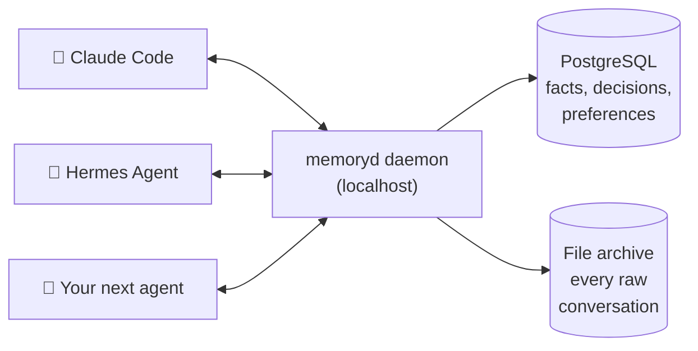
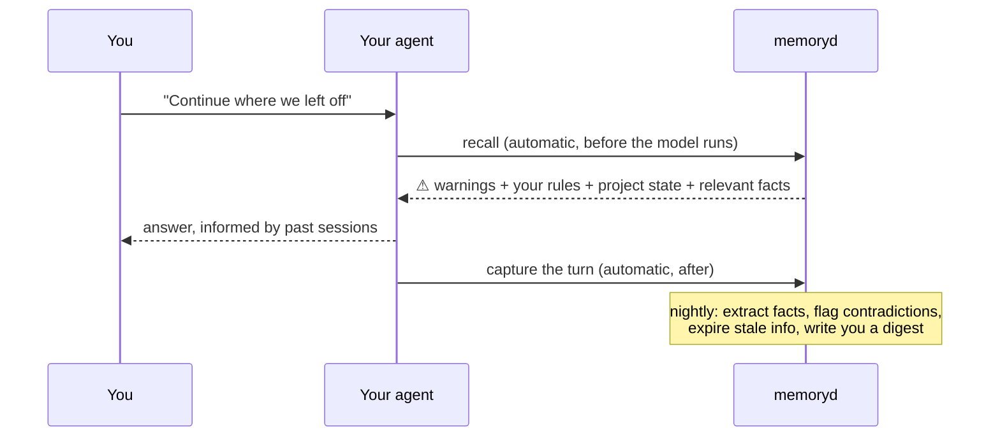

# memoryd

**Shared long-term memory for your AI agents.**

Claude Code forgets everything between sessions. So does Hermes, Codex, and every other agent. memoryd is a small local daemon that gives them all one shared, permanent memory — automatically, on every turn, with you in control of what gets remembered.



Your agents come and go. Your memory stays — local, on your machine, in plain Postgres and files you can read.

## What it does, in plain English

**1. It remembers everything, raw.** Every conversation turn is saved to an append-only ledger and a file archive on your disk. Nothing is ever edited or deleted — this is the evidence everything else is built from.

**2. It's careful about what becomes a "fact".** After each session, an LLM proposes memories ("prefers short commit messages", "never push to main on this repo"). A strict validator then checks each one: does it cite a real source? Did it turn "I *might* switch to X" into "decided to switch to X"? (rejected). Only explicit user instructions become active automatically — everything else waits as an unconfirmed candidate or in a review queue for **you** to approve.

**3. It recalls automatically, before every turn.** You never ask it to remember. Before your agent sees your prompt, memoryd injects a small "memory packet": your standing rules and warnings first (always), then who you are and project state, then the most relevant facts — found by combining keyword and semantic search.

**4. Facts are never overwritten — they're superseded.** When you change your mind, the old fact is kept with an end date and a link to what replaced it. Your agent can answer both "what do I prefer?" and "what *did* I prefer, and when did that change?"



## Safety, built in

- **Scopes ("visas"):** each agent only sees memory it's allowed to. Personal memories never enter a coding agent's context. Verified by planted **canary memories** that must never surface — if one does, an alarm fires.
- **Contradictions open a review, never silently overwrite.** You rule; the loser gets superseded.
- **Fail-open:** if the daemon is down, your agent keeps working and tells you memory was unavailable. It never blocks you.
- **Everything is auditable:** every recalled packet is logged, every fact links back to the exact conversation that produced it.

## Install (5 minutes)

Requires: Linux/macOS, Python 3.11+, PostgreSQL 16 with [pgvector](https://github.com/pgvector/pgvector).

```bash
git clone https://github.com/YOUR_USERNAME/memoryd && cd memoryd
pip install -r requirements.txt

# database
./scripts/init_db.sh
psql -d memoryd -f migrations/002_extraction.sql
psql -d memoryd -f migrations/003_multi_agent.sql

# daemon (run under systemd/launchd for real use)
export MEMORYD_DSN="postgresql://$(whoami)@/memoryd?host=/var/run/postgresql"
export ANTHROPIC_API_KEY=sk-...   # optional: enables fact extraction
python3 -m memoryd.server
```

No API key? It runs in **capture-only mode**: everything is still archived, and extraction backfills later when you add a key.

### Connect Claude Code

```bash
mkdir -p ~/memory/hooks && cp hooks/*.sh ~/memory/hooks/
# merge hooks/settings.snippet.json into ~/.claude/settings.json
```
That's it — recall and capture now run on every turn.

### Connect Hermes Agent

```bash
cp -r hermes_plugin/memoryd ~/.hermes/plugins/memory/memoryd
hermes config set memory.provider memoryd
hermes memoryd status   # should show the daemon is healthy
```

Both agents now share one memory: what Claude Code learns, Hermes knows, and vice versa.

## Daily use

You mostly do nothing. Occasionally:

```bash
python3 -m memoryd.review queue        # approve/reject pending memories (~1 min)
python3 -m memoryd.review approve 3
cat ~/memory/digest/$(date +%F).md     # daily health report
```

Add the nightly consolidation to cron:

```bash
5 3 * * *  MEMORYD_DSN=... python3 -m memoryd.microsleep
```

## Verify your install

```bash
python3 scripts/smoke_test.py      # 19 checks: storage integrity, recall, canaries
python3 scripts/test_extract.py    # 18 checks: fact extraction & promotion rules
python3 scripts/test_vector.py     # 13 checks: semantic search & index rebuild
python3 scripts/test_hermes.py     # 23 checks: Hermes plugin lifecycle
```

## Learn more

- [docs/REFERENCE.md](docs/REFERENCE.md) — full feature reference, configuration, embedder options
- [docs/ARCHITECTURE.md](docs/ARCHITECTURE.md) — the design: why raw evidence is sacred, how promotion works, the threat model, and what's deliberately not built yet

## Status

Early but real: 73 automated checks, tested end-to-end against live Postgres. Built as a "thin vertical slice" of a larger architecture — temporal knowledge graph, more agents, and an audit UI are on the roadmap, gated on evidence from real-world use.

## License

MIT
