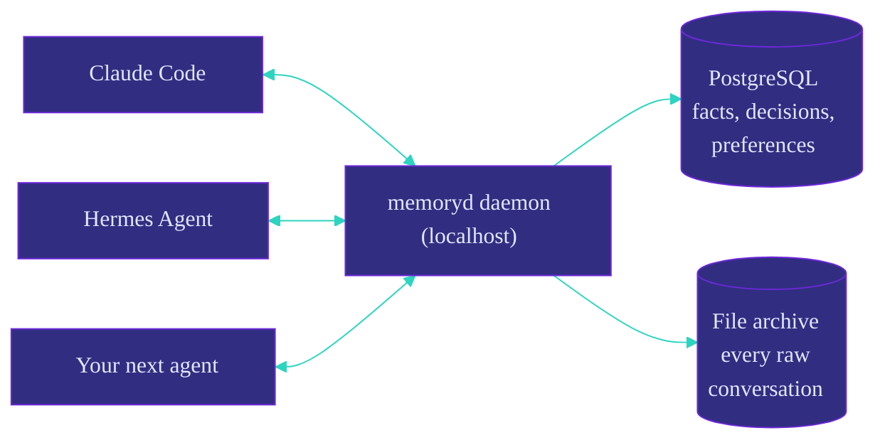
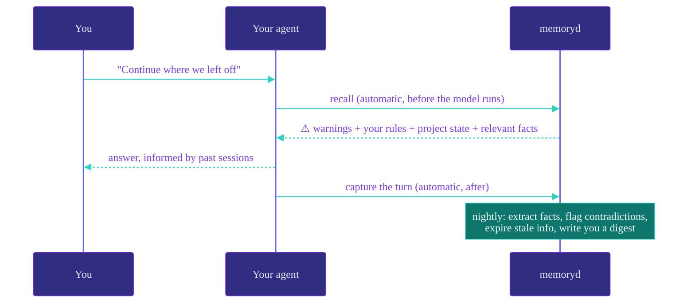

<div align="center">


<p>
  <a href="https://github.com/chrisduvillard/memoryd/actions/workflows/tests.yml"></a>
  <a href="LICENSE"></a>
  
  
  
</p>

[**Install**](#-install-2-minutes) · [**Daily use**](#-daily-use) · [**Docs**](docs/REFERENCE.md) · [**Architecture**](docs/ARCHITECTURE.md)

</div>

Claude Code forgets everything between sessions. So does Hermes, Codex, and every other agent. memoryd is a small local daemon that gives them all one shared, permanent memory — automatically, on every turn, with you in control of what gets remembered.



Your agents come and go. Your memory stays — local, on your machine, in plain Postgres and files you can read.

---

## 🧠 What it does, in plain English

**1. It remembers everything, raw.** Every conversation turn is saved to an append-only ledger and a file archive on your disk. Nothing is ever edited or deleted — this is the evidence everything else is built from.

**2. It's careful about what becomes a "fact".** After each session, an LLM proposes memories ("prefers short commit messages", "never push to main on this repo"). A strict validator then checks each one: does it cite a real source? Did it turn "I *might* switch to X" into "decided to switch to X"? (rejected). Only explicit user instructions become active automatically — everything else waits as an unconfirmed candidate or in a review queue for **you** to approve.

**3. It recalls automatically, before every turn.** You never ask it to remember. Before your agent sees your prompt, memoryd injects a small "memory packet": your standing rules and warnings first (always), then who you are and project state, then the most relevant facts — found by combining keyword and semantic search.

**4. Facts are never overwritten — they're superseded.** When you change your mind, the old fact is kept with an end date and a link to what replaced it. Your agent can answer both "what do I prefer?" and "what *did* I prefer, and when did that change?"



---

## 🛡️ Safety, built in

- **Scopes ("visas"):** each agent only sees memory it's allowed to. Personal memories never enter a coding agent's context. Verified by planted **canary memories** that must never surface — if one does, an alarm fires.
- **Contradictions open a review, never silently overwrite.** You rule; the loser gets superseded.
- **Fail-open:** if the daemon is down, your agent keeps working and tells you memory was unavailable. It never blocks you.
- **Everything is auditable:** every recalled packet is logged, every fact links back to the exact conversation that produced it.

---

## ⚡ Install (2 minutes)

Works on **Windows, macOS, and Linux**. Requires Python 3.11+ and [Docker](https://www.docker.com/products/docker-desktop/) (for the database — or bring your own Postgres, see Appendix A).

```bash
export OPENROUTER_API_KEY=sk-or-...   # optional: enables fact extraction with
                                      # any model (or ANTHROPIC_API_KEY)
pip install git+https://github.com/chrisduvillard/memoryd
memoryd install
memoryd status                     # everything green? you're done.
```

`memoryd install` does the rest, idempotently (safe to re-run any time):

- starts a **PostgreSQL 16 + pgvector container** (`memoryd-pgvector`, localhost-only, persistent volume, restarts with Docker) and applies all migrations
- writes `~/memory/config.json` so the daemon finds its database even when autostarted
- registers the **Claude Code hooks** in `~/.claude/settings.json` (recall before every prompt, capture after every turn)
- installs the **Hermes plugin** if `~/.hermes` exists (otherwise: re-run install after you install Hermes)
- sets up **autostart**: the daemon at logon and the nightly consolidation at 03:05 (Task Scheduler on Windows, systemd user units on Linux, launchd on macOS) — then starts the daemon right away

### 🔑 Why the API key?

memoryd doesn't need a key to *remember* — recording and archiving your conversations is free, local, and always on. The key powers the one step that needs intelligence: **once per session, an AI model reads the transcript and writes down the few facts worth keeping** ("prefers short commit messages", "never push to main on this repo"). Storing raw conversations is easy; deciding *what they mean* — what's a standing rule, what was just a passing thought — takes a language model, and that model runs behind an API.

It's a single small API call per session (about a cent). No key? memoryd runs in **capture-only mode**: everything is still archived, nothing is lost, and the day you add a key it goes back and extracts memories from every session it recorded. Prefer no cloud at all? Point it at a local model (Ollama/LM Studio) — no key, no data leaves your machine.

Pick your provider (env vars, or the `env` map in `~/memory/config.json`):

| Provider | Setup |
|---|---|
| **OpenRouter** (recommended — one key, any vendor's model) | `OPENROUTER_API_KEY`; default model `google/gemini-3.5-flash`, override with `MEMORYD_LLM_MODEL=<any slug>` |
| Anthropic | `ANTHROPIC_API_KEY` (default model: Claude Haiku 4.5) |
| Local / keyless (Ollama, LM Studio) | `MEMORYD_LLM=openai` + `MEMORYD_LLM_BASE=http://localhost:11434/v1` + `MEMORYD_LLM_MODEL=<model>` |

The OpenRouter default was picked empirically: six small models benchmarked through memoryd's own extraction pipeline and scored by its validator (does the standing rule land? does "might switch to X" stay uncommitted? are citations real?) — `gemini-3.5-flash` extracted the rules most reliably with zero malformed outputs.

> **Semantic search note:** the default embedder is a dependency-free lexical hash — good enough to try memoryd offline, but it won't match paraphrases. For real use set `MEMORYD_EMBED=voyage` (or `openai`, incl. Ollama/LM Studio) — see [docs/REFERENCE.md](docs/REFERENCE.md).

### 🔌 Connect Claude Code

Done by `memoryd install` — recall and capture run on every turn. For manual setups, see `hooks/settings.snippet.json`.

### 🤝 Connect Hermes Agent

If `~/.hermes` existed at install time the plugin is already in place; otherwise re-run `memoryd install`. Then activate it:

```bash
hermes config set memory.provider memoryd
hermes memoryd status   # should show the daemon is healthy
```

Both agents now share one memory: what Claude Code learns, Hermes knows, and vice versa.

---

## 🔁 Daily use

You mostly do nothing. Occasionally:

```bash
memoryd status                     # is everything actually working?
memoryd review queue               # approve/reject pending memories (~1 min)
memoryd review approve 3
cat ~/memory/digest/$(date +%F).md # daily health report (written nightly)
```

---

## ✅ Verify your install

<details>
<summary><strong>Run the full check suite</strong> — <code>memoryd status</code> + test scripts</summary>

<br>

```bash
memoryd status                     # daemon, DB, hooks, autostart, spool backlog
python scripts/smoke_test.py       # 19 checks: storage integrity, recall, canaries
python scripts/test_extract.py     # 20 checks: fact extraction & promotion rules
python scripts/test_vector.py      # 13 checks: semantic search & index rebuild
python scripts/test_hermes.py      # 23 checks: Hermes plugin lifecycle
python scripts/test_bitter_lesson.py # DB-free checks: model/policy/eval extension points
```

(The test scripts write throwaway `smoketest`/test rows into your live database; fine for a fresh install.)
`test_bitter_lesson.py` is the exception: it is DB-free and safe to run without
a daemon.

</details>

---

## 🧰 Appendix A — manual install (bring your own Postgres, no Docker)

<details>
<summary><strong>Bring your own Postgres / run everything by hand</strong></summary>

<br>

Point `MEMORYD_DSN` at any PostgreSQL 16 database with pgvector **before** running `memoryd install` — it will skip Docker and use yours:

```bash
./scripts/init_db.sh               # or let `memoryd install` apply migrations
export MEMORYD_DSN="postgresql://$(whoami)@/memoryd?host=/var/run/postgresql"
memoryd install
```

To run everything by hand instead: `memoryd serve` in the foreground, `memoryd microsleep` nightly via cron, and merge `hooks/settings.snippet.json` into `~/.claude/settings.json` (replace `<PYTHON>` with your interpreter).

**Security note:** the Docker container uses the password `memoryd` and binds `127.0.0.1` only. If you expose Postgres beyond localhost, change the password and the DSN in `~/memory/config.json`.

</details>

---

## 📚 Learn more

- [docs/REFERENCE.md](docs/REFERENCE.md) — full feature reference, configuration, embedder options
- [docs/ARCHITECTURE.md](docs/ARCHITECTURE.md) — the design: why raw evidence is sacred, how promotion works, the threat model, and what's deliberately not built yet

---

## 🚦 Status

Early but real: 100+ automated checks, tested end-to-end against live Postgres plus DB-free extension-point regressions. Built as a "thin vertical slice" of a larger architecture — temporal knowledge graph, more agents, and an audit UI are on the roadmap, gated on evidence from real-world use.

---

## 📄 License

Apache-2.0. See [LICENSE](LICENSE).

Third-party notices for vendored compatibility stubs are in
[THIRD_PARTY_NOTICES.md](THIRD_PARTY_NOTICES.md).
